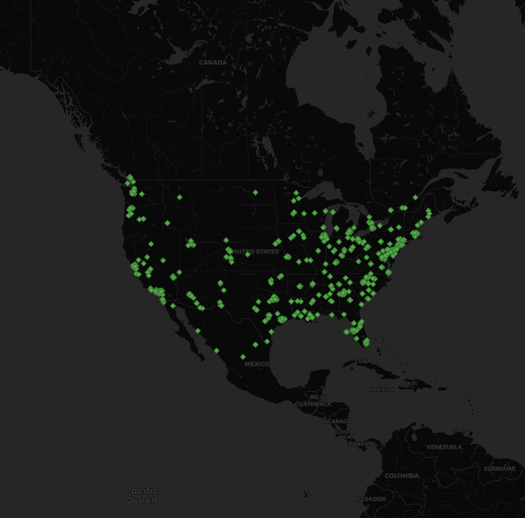
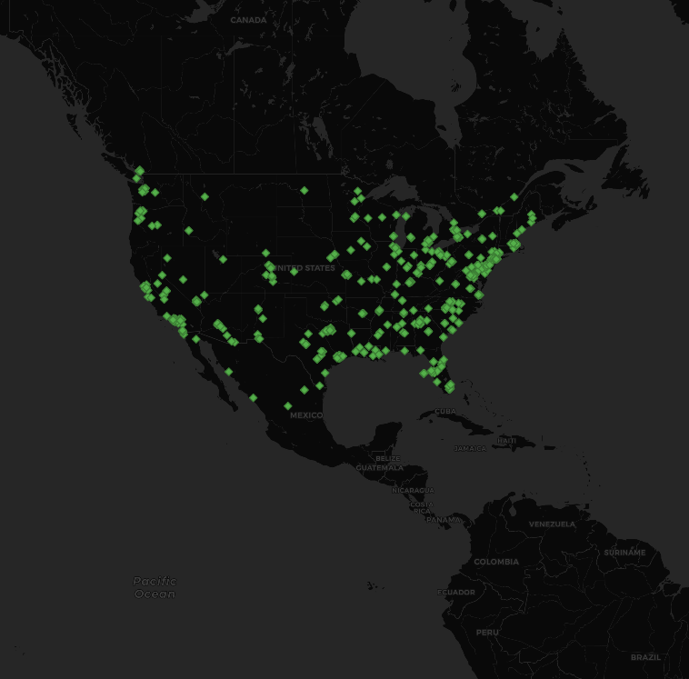

# Geo tagged US tweets
My python code collected a CSV file using Twitter's API the recorded locations of every tweet for a 60 second time interval.
The result was a map of geo-tagged tweets across the US collected on January 25th, 2021. 
I collected every tweet by filtering them to contain the word "Biden", which should contain a lots of data in referenc to the recent inauguration.
The distribution of tweets throughout the map is logical, as clusters of tweets were found near major US population centers 
such as Los Angeles and New York. Additionally, there were little to no tweets coming from sparsely populated places such as 
middle America and Alaska. Overall I think that the longer we collect tweets, the more the map will look exactly like 
the population distribution of the United States.

